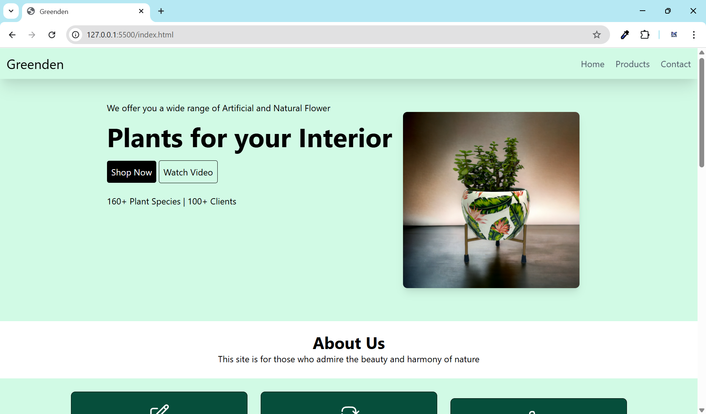
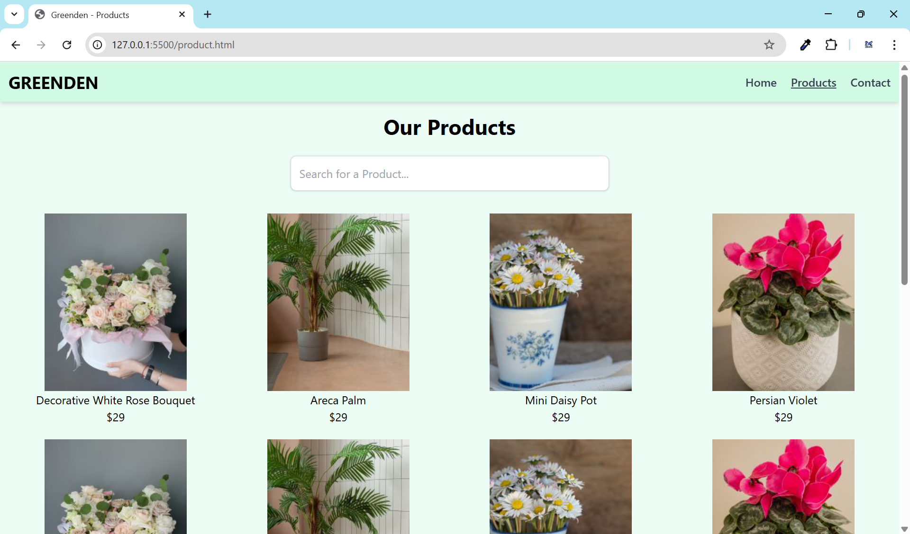
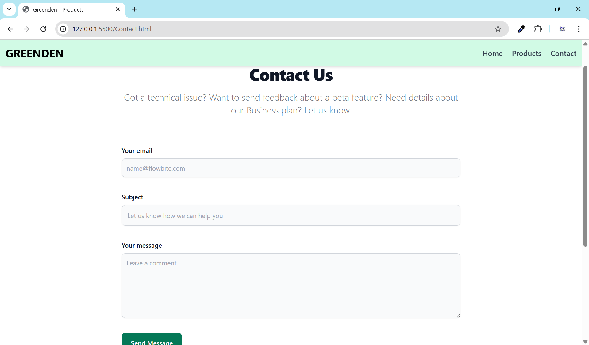

# 🌿 Greenden - Plant Shop Website

Welcome to **Greenden**, a responsive and elegant plant-selling website built using **HTML** and **Tailwind CSS**. This project showcases a modern plant shopping experience with product listings, customer reviews, newsletter subscriptions, and a working contact form.

---

## 🔗 Live Demo

🖥️ Click here to view the live website:  
👉 [Greenden Live Site](https://your-github-username.github.io/greenden/)

> ⚠️ Replace with your actual GitHub Pages deployment URL

---

## 📸 Preview

### 🏠 Home Page

### 🛒 Product Page

### ✉️ Contact Page

---

## 🚀 Features

- ✅ **Responsive Design** (Mobile, Tablet, Desktop)
- 🛒 **Product Page** with grid layout
- 📦 Best Seller Section
- 🌟 Customer Reviews
- 📨 Newsletter Subscription
- 📬 Contact Form
- 🧠 Fully built with **Tailwind CSS**

---

## 🛠️ Built With

- HTML5
- Tailwind CSS v2.2.9
- No external JS frameworks (purely frontend)

## 📧 Contact

If you'd like to connect or collaborate:

- 👨‍💻 **Developer**: [Ulaganathan](mailto:ulaganathana7@gmail.com.com)
- 🌐 LinkedIn: [Ulaganathan's LinkedIn](https://www.linkedin.com/in/ulaga-nathan-dev/)
- 💼 Portfolio: Coming Soon
- 📩 Email: ulaganathana7@gmail.com

---

## ⭐ Credits

- 👨‍🎨 Design & Development by **Ulaganathan**
- 🌿 Inspired by modern plant ecommerce websites
- 🛠 Icons used from [Heroicons](https://heroicons.com/)
- 🖌 Built using [Tailwind CSS](https://tailwindcss.com/)

---

## 📜 License

This project is licensed under the **MIT License**.

You are free to use, modify, and distribute this project with proper credit to the original author.

